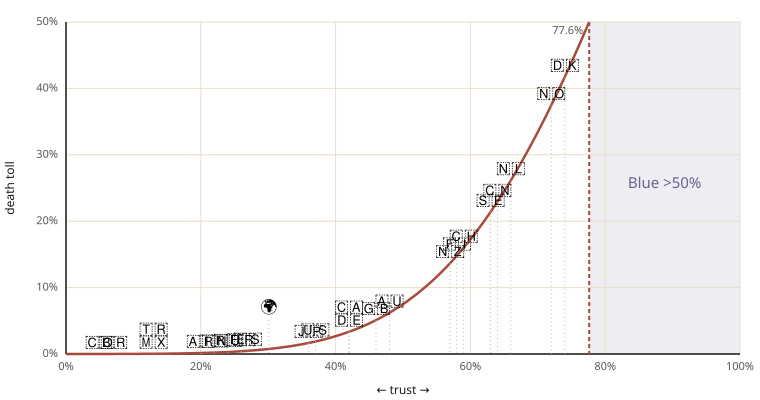
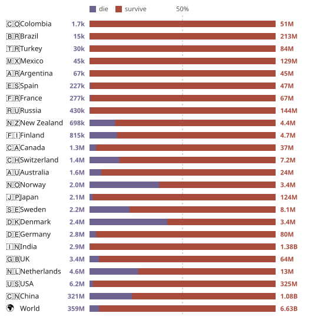

# red button / blue button

Simulation behind the essay **[Which button?](https://aesv.io/etc/which-button)**.

Everyone privately presses red or blue. If more than half of everyone presses blue, everyone lives; otherwise only the red-pressers live.

## Results

| metric | value |
|---|---|
| world death rate | **5.1%** |
| does blue ever win | **no** — not in any country, not in the world |
| highest | Denmark, **42%** |
| lowest | Colombia, **~1,700** people |
| China share of world toll | **89%** |
| world death rate without China | **0.7%** (below the US) |
| confirmed at | **6,991,900,000** agents (matches the closed form to 0.0004 pp) |

Rule: press blue iff `trust × (1 + altruism) ≥ 1`. Altruism `a = 0.28`, Beta concentration 7, no misclick. Global: blue wins iff `>50%` of everyone presses blue.

## Figures





## Run

```bash
pip install -r requirements.txt
python -m scripts.model              # results -> data/canonical_results.json
python -m scripts.model --confirm    # ~7e9-agent confirmation (slow)
python -m scripts.plot_death_curve   # -> figures/death-curve.svg
python -m scripts.plot_toll_bars     # -> figures/toll-bars.svg
python -m unittest tests.test_model
```

## Data

`data/countries.json` — trust (WVS Wave 7 / EVS 2017), altruism (Engel 2011), population (UN 2022); sources in `_meta`. China's 64% trust is contested and the world figure leans on it.
